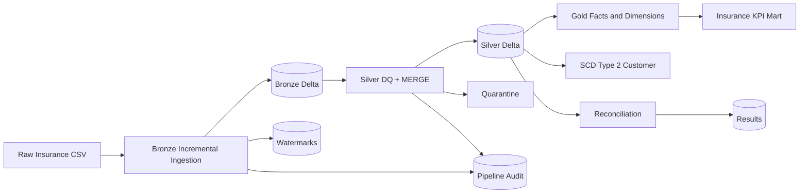

# Architecture

```mermaid
flowchart LR
A[Raw Insurance CSV]-->B[Bronze Incremental Ingestion]
B-->C[(Bronze Delta)]
C-->D[Silver DQ + MERGE]
D-->E[(Silver Delta)]
D-->Q[Quarantine]
E-->G[Gold Facts and Dimensions]
E-->S[SCD Type 2 Customer]
G-->M[Insurance KPI Mart]
B-->W[(Watermarks)]
B-->AU[(Pipeline Audit)]
D-->AU
E-->R[Reconciliation]
R-->RR[(Results)]
```
